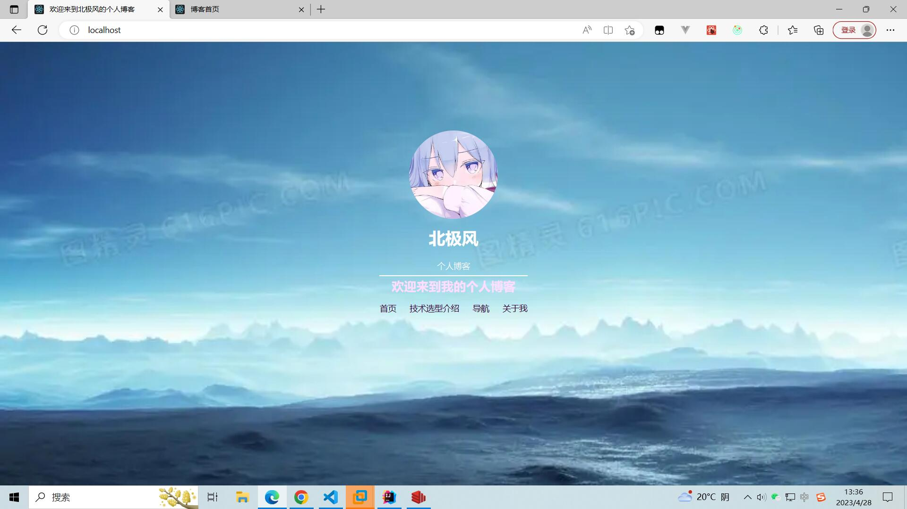
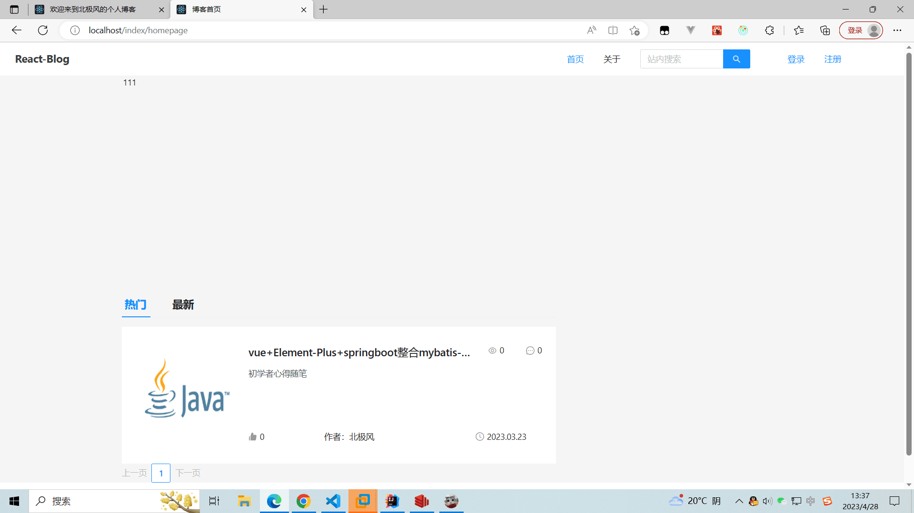
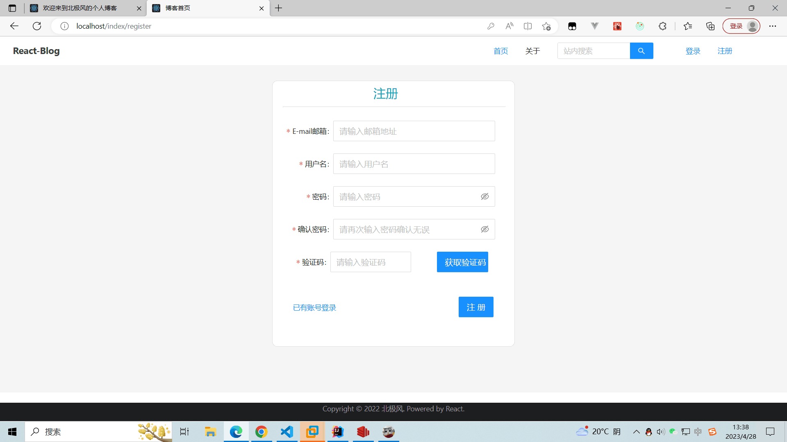
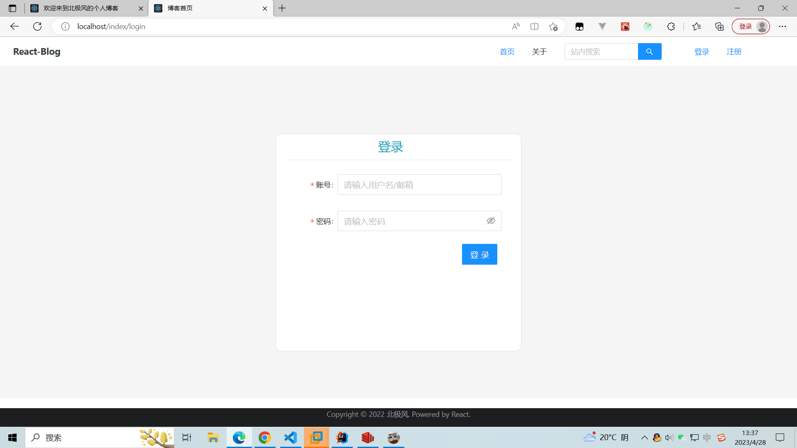
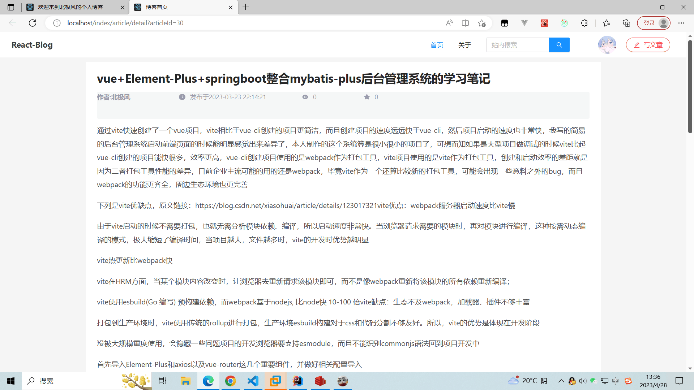
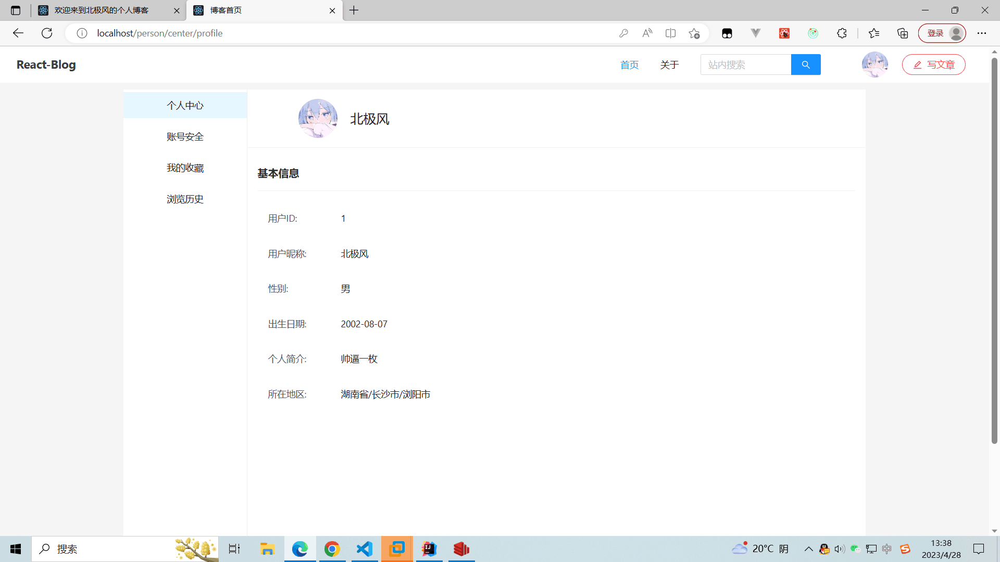

# 欢迎使用北极风的个人博客系统
## 项目运行环境的一些版本配置：
* RDBMS:MySQL `v8.0.28`
* 数据库连接池:druid `1.1.23`
* 缓存Redis `v6.0`
* MongoDB  `v4.4.17`
* JAVA `8`
* springboot `v2.6.11`
* 定时任务框架 `quarz` 
* 安全框架 `spring-security`
* 图片上传功能 `smms`
* 面向切面编程: `aspectj`
* 对象转换框架: `mapstruct`
* 其他详情见项目各个模块的Pom.xml文件

## 本地运行这个项目
### 1.拉取项目到本地 
`git clone https://github.com/zsg4399/Arctic-blog-backend.git`

### 2.修改application.yml
* 将druid配置下的 `username`和 `password`配置项修改成自己的，并且确认自己的MySQL版本高于5
* 将Redis部分相关的配置根据注释进行修改
`mail:
host: smtp.qq.com  #设置邮箱类型 
username: yourEmail       #邮箱地址 
password: yourSmtpToken   #授权码 
default-encoding: UTF-8`
* MongoDB自行安装好后修改application.yml中的配置
### 3.修改图片上传功能
在`imagecontroller`下的`getUploadToken`接口是返还smms的api token，前端拿到这个token后就能直接进行图片上传功能，如果需要使用这个功能，只需要注册smms后拿到自己账号的api token，然后将ImageController下的Access_Token常量修改为你的api token即可
### 4.数据库建表搭建
请执行仓库内sql文件夹下的blog.sql文件
### 5.开始运行项目
当你完成上述步骤，并且配置了项目所需要的 `Redis`、`Mysql`等环境后，进入启动类执行run方法即可启动项目
### 6.前端项目：
本项目是前后端分离的，所以需要前端界面项目的请点击[Arctic-Blog-Front](https://github.com/zsg4399/Arctic-Blog-Front)
## 项目功能介绍
* 支持用户登录和注册功能模块，基于jwt+springsecurity自定义实现的几个过滤器完成登录、鉴权的功能，登录后用户可以七天内免登录
* 支持用户发布文章，收藏点赞功能
* 评论功能预计下个版本发布
* 支持用户个人中心，用户可以修改自己的基本信息以及账号安全管理
## 项目效果展示图
* ### 欢迎页界面：

* ### 首页效果界面图：

* ### 注册效果界面图：

请确保输入的邮箱账号存在，否则你将无法收到验证码完成注册
* ### 登录效果界面图

* ### 查看文章详情内容

* ### 查看个人信息

